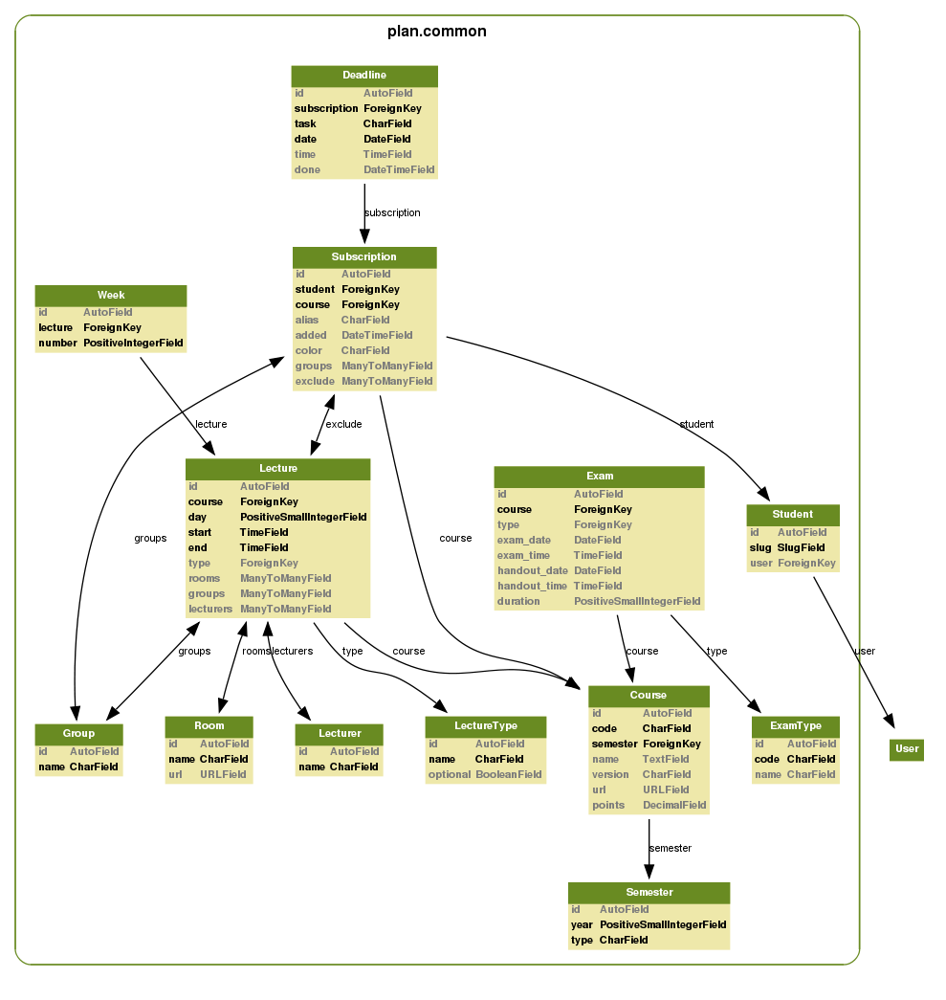

Development
===========

The following recipe should have you up and running with a local development
instance of the site in no time.

#. Retrieve source from VCS.
#. ``> cd plan``
#. ``> ./manage.py syncdb``
#. ``> ./manage.py synccompress``
#. ``> ./manage.py courses -w``
#. ``> ./manage.py exams``
#. ``> ./manage.py lectures -w``
#. ``> ./manage.py runserver``
#. http://localhost:8000

Django Compress
---------------

Media CSS and JS files are only updated when ``./manage.py synccompress`` is
run, to change this update :file:`plan/settings/local.py` with the `Django
Compress settings <http://code.google.com/p/django-compress/wiki/Configuration>`_
you want.

Datamodel
---------

Running tests
-------------

Plan has a decent level of test coverage that ensures that most of the building
blocks and basic use-cases for the site remain functioning.

::

    > ./manage.py test
    Creating test database...
    Creating table django_admin_log
    Creating table auth_permission
    ...
    Installing index for common.Lecture model
    Installing index for common.Deadline model
    ...........................................
    ----------------------------------------------------------------------
    Ran 43 tests in 26.874s

    OK
    Destroying test database...

Django's test framework assumes that the database-user has CREATE DATABASE
rights in order to create a test database that can be completely reset.  If the
user setup does not have these rights running the test with the following
command will run the tests with an in-memory SQLite3 database: ``./manage.py
test --settings=settings.test``

For more info see `<http://docs.djangoproject.com/en/dev/topics/testing/>`_

See also
--------
* `General Django documentation <http://docs.djangoproject.com/en/1.0/>`_
