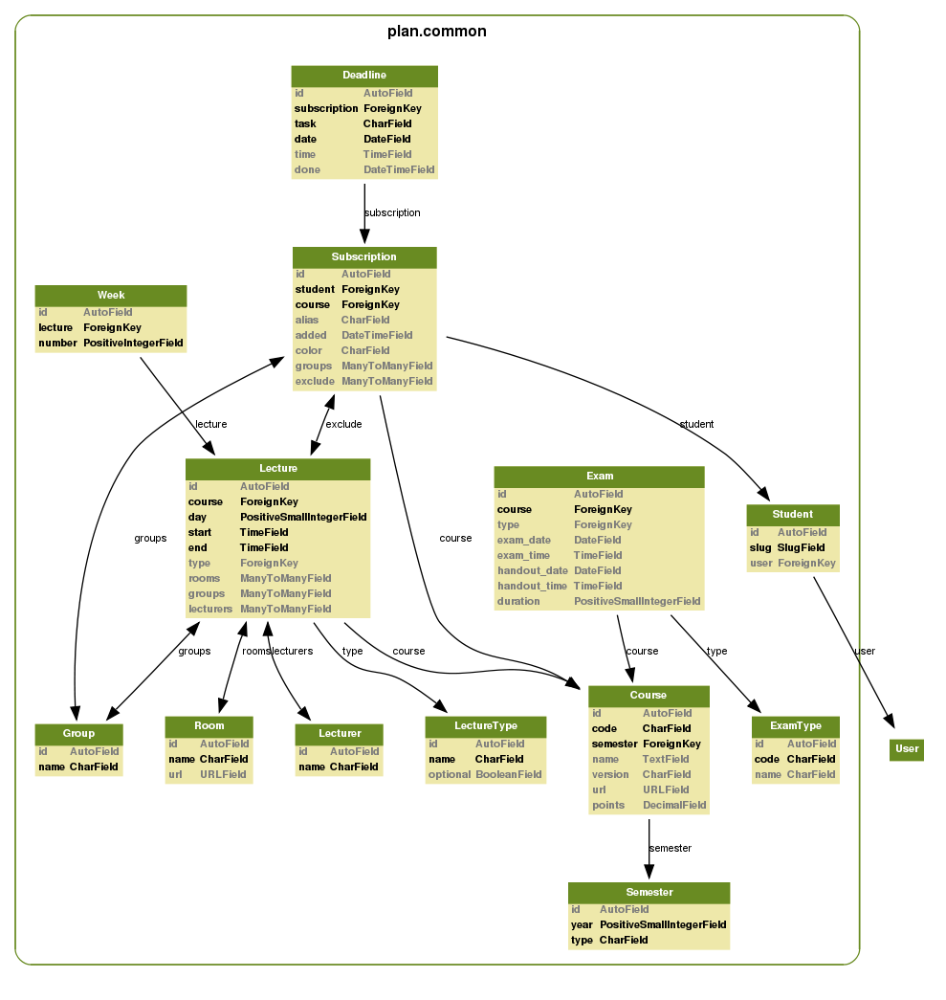

Development
===========

.. seealso::
  `General Django documentation <http://docs.djangoproject.com/en/dev/>`_

Quickstart
----------

The following recipe should have you up and running with a local development
instance of the site in no time.

#. Retrieve source from VCS.
#. ``> cd plan``
#. ``> ./manage.py syncdb``
#. ``> ./manage.py synccompress``
#. ``> ./manage.py courses -w``
#. ``> ./manage.py exams``
#. ``> ./manage.py lectures -w``
#. ``> ./manage.py runserver``
#. http://localhost:8000

Datamodel
---------

Translations
------------

Note that :mod:`plan.translation` provides the i18n templatetags for this
project. Ie. use ```` instead of ````
in templates.

This package provides the same tags as i18n, and the ```` tag
in addition.

.. seealso::
   `<http://docs.djangoproject.com/en/dev/topics/i18n/localization/#topics-i18n-localization>`_

Running tests
-------------

Plan has a decent level of test coverage that ensures that most of the building
blocks and basic use-cases for the site remain functioning.

::

    > pytest
    Creating test database...
    Creating table django_admin_log
    Creating table auth_permission
    ...
    Installing index for common.Lecture model
    Installing index for common.Deadline model
    ...........................................
    ----------------------------------------------------------------------
    Ran 43 tests in 26.874s

    OK
    Destroying test database...

The default test runner provisions an ephemeral PostgreSQL instance, so local
database users do not need CREATE DATABASE rights.

.. seealso::
  `<http://docs.djangoproject.com/en/dev/topics/testing/>`_
